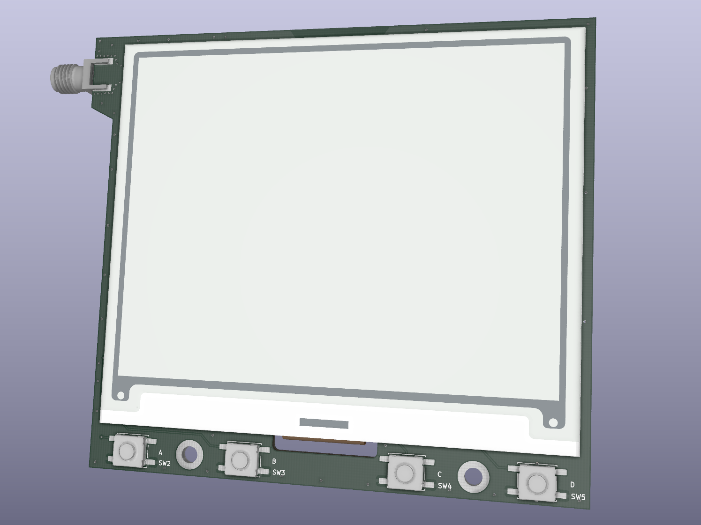
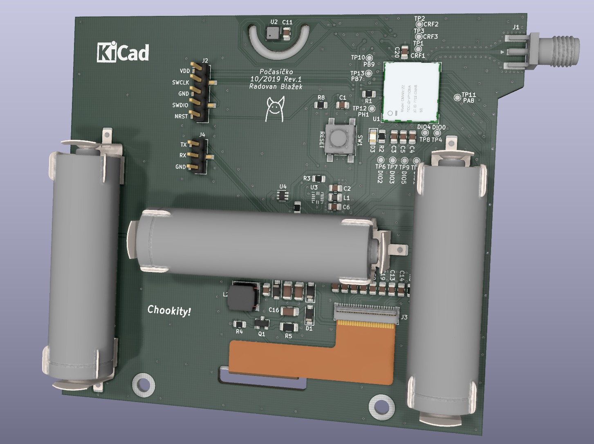

# Počasíčko

LoRa node with e-paper display and BME680
- Murata CMWX1ZZABZ-091: Semtech SX1276 + STM32L072
- Bosch Sensortec BME680 measures pressure, humidity, temperature and Volatile Organic Compounds (VOC)
- Waveshare 4.2" EPD 400x300
- Powered from three AA batteries

[Schematic](./pcb/revision_1/pocasicko-schematic.pdf)

Inline-style: 

---
Počasíčko means little weather in Czech
